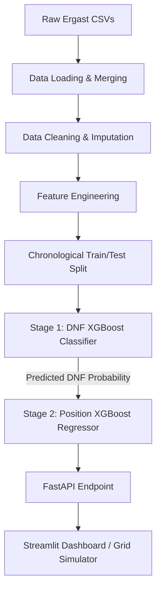

# Formula 1 Race Outcome Predictor: Stacked Machine Learning Pipeline

A production-grade, two-stage machine learning system that predicts driver DNF (Did Not Finish) probabilities and final finishing positions for Grand Prix races. Built on historical Formula 1 data from 1950 to the present, this project transitions from basic predictive analytics to a production-level stacked architecture with a FastAPI backend and Streamlit frontend.

---

## Project Architecture & Data Flow

The system employs a **stacked model architecture** where predictions from a Stage 1 classifier are fed as engineered features into a Stage 2 regressor to predict final standings.



---

## 1. The Learning Path & Developer Journey

This project represents a complete, structured journey from writing the first lines of Python in data science to designing a production-grade machine learning pipeline. 

### Phase 1: Kaggle Titanic (Classification & Core Fundamentals)
*   **Active Typing vs. Copy-Pasting**: The journey began by breaking the habit of "vibe-coding" (passive copying) and transitioning to typing code line-by-line to build muscle memory.
*   **Exploratory Data Analysis (EDA)**: Mastered basic Pandas operations (`df.head()`, `df.info()`, `df.describe()`, `df.isnull().sum()`) to understand the layout and gaps in raw data.
*   **Data Preprocessing**: Learned how to map categoricals (converting Sex string values to `0` and `1`), impute missing values (filling missing ages with the mean), and use `.copy()` to avoid the notorious `SettingWithCopyWarning`.
*   **Validation Trap**: Discovered why testing a model on its training data is a "cheat" (memorization) and implemented train-test splits to accurately measure generalization.
*   **Hyperparameter Tuning**: Learned to tune a Random Forest Classifier using `RandomizedSearchCV` (`n_estimators`, `max_depth`, `min_samples_split`, `max_features`).
*   **The Feature Ceiling**: Discovered that model tuning has limits; the biggest performance gains (breaking past 79.4% to 82%+) come from smart feature engineering (e.g., grouping siblings/parents into family size, extracting titles from names).
*   **Performance Metrics**: Shifted from raw accuracy to evaluating models using Precision, Recall, F1-Score, and Confusion Matrices.

### Phase 2: Kaggle House Prices (Regression & Continuous Prediction)
*   **Classification vs. Regression**: Shifted from binary classification to predicting continuous numerical values.
*   **Logarithmic Transformations**: Learned to analyze the skewness of target variables (e.g., Sale Price) and apply `np.log1p` to normalize the distribution for linear/tree-based models.
*   **Missing Value Imputation**: Designed rules for handling missing categorical features (filling with mode or creating 'None' categories) and numerical features (filling with median).
*   **Categorical Encoding**: Handled high-cardinality categorical data using One-Hot Encoding.
*   **Regression Metrics**: Mastered evaluation using Mean Absolute Error (MAE) and Root Mean Squared Error (RMSE).

### Phase 3: The F1 Predictor (Stacked Pipelines & Software Engineering)
*   **Transition to Production Code**: Moved from experimental Jupyter notebooks to a structured, modular Python repository using virtual environments (`requirements.txt`), `src/` modules, and run scripts.
*   **Telemetry vs. Probability**: Realized that without private team telemetry (gearbox wear, temperature), a model cannot predict specific mechanical failures with 100% precision. The model acts as a "risk index" based on historical patterns (circuit collision rates, team reliability history).
*   **Advanced Stacking**: Built a multi-stage stacked model where the DNF classifier's output probability directly adjusts the finishing position regressor's predictions.
*   **Preventing Time-Series Leakage**: Replaced random train-test splitting with strict chronological splitting (training on pre-2022 data, testing on 2022+ hybrid era data).
*   **Complex Feature Engineering**: Implemented rolling window aggregations (`rolling(10).mean()`) grouped by driver, constructor, and circuit, using `shift(1)` to strictly prevent data leakage.
*   **Feature Interactions**: Discovered how tree-based models like XGBoost handle complex interactions (e.g., identifying that a championship leader starting from the back due to a penalty behaves differently than a typical backmarker).
*   **Deployment**: Wrapped models in a FastAPI backend and created an interactive Streamlit UI.

---

## 2. Data Sources & Schema Mapping

The dataset is compiled from the Ergast Formula 1 World Championship dataset. 9 relational tables are cleaned and merged:
*   `results.csv` (Core race results)
*   `status.csv` (F1-defined retirement/finishing codes)
*   `races.csv` (Grand Prix metadata, years, rounds, circuits)
*   `drivers.csv` (Driver demographics)
*   `constructors.csv` (Constructor information)
*   `qualifying.csv` (Qualifying sessions)
*   `circuits.csv` (Track geolocation and metadata)
*   `driver_standings.csv` (Running championship standings)
*   `constructor_standings.csv` (Running team standings)

### Schema Cleanup & Merging Pipeline
1.  **Duplicate Removal**: Redundant metadata columns (such as `url` fields across all Ergast tables) were dropped.
2.  **Collision-Free Renaming**: Collaiding column names were mapped explicitly to avoid naming clashes:
    *   Driver properties → `driver_forename`, `driver_surname`, `driver_nationality`
    *   Constructor properties → `constructor_name`, `constructor_nationality`
    *   Qualifying rank → `qualifying_position`, `driver_number`
    *   Standings → prefixed as `driver_championship_points`/`driver_championship_position`/`driver_wins` and `constructor_championship_points`/`constructor_championship_position`/`constructor_wins`
3.  **Left Joining**: All metadata tables were left-joined to the core `results` table using chronological matching keys (`raceId`, `driverId`, `constructorId`, `circuitId`).

---

## 3. Exploratory Data Analysis (EDA) & Key Findings

*   **Overall DNF Baseline**: Historically, the baseline DNF rate sits around 39.7% (excluding non-race statuses like withdrawals). However, this varies massively by decade due to technological advancements.
*   **Decade Reliability Trend**: Cars from the 1980s and 1990s suffered DNF rates exceeding 40-50% due to fragile turbo engines and mechanical unreliability. In the modern hybrid era (2014-present), DNF rates have plummeted to ~15-20%, making modern retirements much harder to predict.
*   **Circuit Difficulty**: Street circuits such as Monaco, Baku, Marina Bay (Singapore), and Jeddah show significantly higher DNF rates (frequent wall collisions, safety cars) compared to permanent racetracks like Monza or Paul Ricard.
*   **Grid Position Risk**: Drivers starting at the back of the grid (P15-P20) suffer a disproportionate number of DNF events, largely driven by opening-lap collisions in traffic clusters.
*   **Class Imbalance**: Finishing a race is the majority class (~60-80% in the modern era), meaning a naive model predicting "Always Finish" would achieve high accuracy but fail to predict any retirements. This motivated the shift to optimizing the **F1-score** rather than raw accuracy.

---

## 4. Data Cleaning, Imputation & Leakage Prevention

### Target Variable Definitions
*   **DNF (Stage 1 Target)**: Standardized as `1` if a driver retired due to mechanical failure, collision, or accident. Standardized as `0` if a driver finished the race (including being lapped: e.g., `+1 Lap`, `+2 Laps`, which Ergast records as finishing statuses).
*   **Finishing Position (Stage 2 Target)**: Standardized to `positionOrder` because it ranks all 20 drivers sequentially. If a driver retired, their DNF order determines their final position (first to retire gets P20, latest to retire gets P16, etc.), preserving a clean ranking.
*   **Invalid Status Filtering**: Statuses such as *'Did not qualify'*, *'Did not prequalify'*, *'Withdrew'*, and *'Excluded'* were removed because they do not reflect actual race-day performance.

### Data Leakage Prevention (Crucial Decision Point)
To build a realistic pre-race predictive model, we cannot use any data that is determined *during* or *after* the race.
*   **Violations Avoided**: Features like actual race lap times, fastest lap speeds, final points awarded, or final race positions were excluded.
*   **Lagged Features**: All rolling averages (DNF rates, average positions) are shifted back by 1 race (`shift(1)`), ensuring the model only uses history up to the *previous* round.

### Imputation Logic
*   **Qualifying Positions**: For early seasons or rare sessions missing qualifying times, missing qualifying ranks were imputed using the maximum grid position for that race (placing them at the back of the grid).
*   **Standings**: Driver and constructor standings for the season opener (round 1) are imputed with `0` for points and wins, and the median standings rank for positions.

---

## 5. Feature Engineering & Logic

### Stage 1: DNF Classifier Features
*   `driver_experience`: The cumulative count of race starts for the driver (`groupby('driverId').cumcount()`), capturing driving maturity.
*   `constructor_dnf_rate` (Rolling 20, 10, 5 races): The team's DNF rate over recent races, shifted by 1. Captures mechanical reliability trends.
*   `driver_dnf_rate` (Rolling 20, 10, 5 races): The driver's retirement rate over recent races, shifted by 1. Captures crash-proneness or bad luck.
*   `circuit_dnf_rate` (Rolling 10 races): The track's historical DNF rate, capturing circuit danger.
*   `is_street_circuit`: A binary flag (`1` or `0`) for street circuits: Monaco, Singapore, Baku, Albert Park, Valencia, Jeddah, Miami, and Las Vegas.

### Stage 2: Finishing Position Regressor Features
*   `dnf_probability`: The predicted probability of retirement generated by the Stage 1 Classifier.
*   `driver_avg_position`: Rolling 10-race average of the driver's final `positionOrder`, shifted by 1. Imputed with a neutral midfield default of `10.0` for rookies.
*   `constructor_avg_position`: Rolling 10-race average of the constructor's final `positionOrder`, shifted by 1. Imputed with `10.0` for new teams.
*   `grid_penalty`: Engineered as `grid - qualifying_position`.
    *   **Positive Value**: The driver dropped places (engine changes, gearbox changes, or collision penalties).
    *   **Negative Value**: The driver moved up (benefited from other drivers' penalties).
    *   **Logic**: This feature provides strong predictive value. A driver starting deep in the pack due to a grid penalty often has a faster car (fresh engine components, high qualifying pace) and is highly likely to climb forward during the race.

---

## 6. Modeling & Validation Strategy

### Chronological Train-Test Split
Using a random train-test split on time-series data is a critical error in machine learning because it allows future information to predict past events. To prevent this:
*   **Training Set**: Races from **2014 to 2021** (covering the turbo-hybrid era).
*   **Testing/Validation Set**: Races from **2022 to the present** (incorporating the ground-effect regulatory era).

### Stage 1: DNF Classifier (XGBClassifier)
*   **Class Imbalance Handling**: Optimized using `RandomizedSearchCV` targeting the **F1-score** rather than accuracy, adjusting `scale_pos_weight` to balance the DNF minority class.
*   **Hyperparameter Search Space**:
    ```python
    param_grid = {
        'n_estimators': [100, 200, 300, 500],
        'learning_rate': [0.01, 0.05, 0.1],
        'max_depth': [3, 4, 5, 6],
        'subsample': [0.6, 0.8, 1.0],
        'colsample_bytree': [0.6, 0.8, 1.0],
        'scale_pos_weight': [4, 6, 8, 10, 15]
    }
    ```
*   **Key Decision Point (The Precision Ceiling)**: Precision-recall analysis revealed that precision remains around 15-20% across thresholds. Because mechanical engine blowups, tire punctures, and racing incidents are inherently stochastic, a deterministic "DNF vs. Finish" prediction has a low ceiling. Instead, the model is utilized as a **probabilistic risk index** rather than a binary classifier.

### Stage 2: Finishing Position Regressor (XGBRegressor)
*   **Baseline Model**: A dummy regressor predicting the mean finishing position (MAE: 4.98 positions).
*   **Random Forest Regressor**: Achieved an MAE of 3.02 positions.
*   **Optimized XGBoost Regressor**: Engineered with `RandomizedSearchCV` targeting negative Mean Absolute Error (`neg_mean_absolute_error`).
*   **Final Performance**: Best XGBoost model achieved an **MAE of 2.92 positions**, a major improvement over the baseline.
*   **Feature Importances**:
    1.  `driver_championship_position` (37.1%) - Captures season-long performance.
    2.  `dnf_probability` (21.1%) - Validates the stacked model approach.
    3.  `constructor_championship_position` (9.5%) - Captures overall team strength.
    4.  `qualifying_position` (6.3%) - Captures single-lap pace.

---

## 7. Project Directory Structure

```
f1-predictor/
├── data/
│   ├── raw/            # Raw Ergast CSV files
│   └── processed/      # Combined f1_cleaned.csv dataset
├── models/             # Pickled XGBoost classifiers and regressors (.pkl)
├── notebooks/          # Exploratory research and pipeline prototypes
│   ├── 01_dnf_probability.ipynb
│   └── 02_finishing_position.ipynb
├── src/                # Modular codebase
│   ├── api.py          # FastAPI service endpoints
│   ├── data_loading.py # Data loader and merging pipeline
│   ├── dnf_features.py # Feature engineering for DNF model
│   ├── dnf_train.py    # Training and hyperparameter tuning for DNF model
│   ├── dnf_predict.py  # DNF inference functions
│   ├── position_features.py # Position features and pipeline stacker
│   ├── position_train.py    # Training and tuning for Position model
│   ├── position_predict.py  # Position inference functions
│   ├── retrain.py      # End-to-end retraining script
│   └── streamlit_app.py# Streamlit visualization application
├── requirements.txt    # Project dependencies
└── README.md           # Documentation
```

---

## 8. Production Deployment & Interface

### FastAPI Service (`src/api.py`)
Provides RESTful endpoints for single predictions and full race simulations:
1.  `GET /health`: Model availability and health check.
2.  `POST /predict/dnf`: Returns a driver's probability of retiring.
3.  `POST /predict/position`: Returns a driver's predicted finishing position.
4.  `POST /predict/race`: Accepts a full 20-driver grid list. It runs the stacked pipeline for all drivers, ranks them sequentially based on regressor scores, and returns sorted predicted finishing positions along with DNF risk percentages.

### Streamlit Dashboard (`src/streamlit_app.py`)
Offers a visual web frontend with two tabs:
*   **Single Driver**: Select features via interactive sliders/inputs and get instant DNF probability and predicted position.
*   **Full Race Simulator**: Simulates a complete race by calling the FastAPI endpoint for the entire starting grid, sorting the field from P1 to P20.

---

## 9. Usage & Execution

### Setup Environment
1.  Install dependencies:
    ```bash
    pip install -r requirements.txt
    ```

### Run FastAPI Server
Start the backend server on `localhost:8000`:
```bash
cd src
uvicorn api:app --reload
```

### Run Streamlit Frontend
Launch the interactive web UI:
```bash
cd src
streamlit run streamlit_app.py
```

### Retrain Models End-to-End
If fresh race data is added, run the retraining pipeline:
```bash
python src/retrain.py
```
This script re-aggregates the data, performs feature engineering, runs randomized search CV, and exports the optimized models directly to the `/models` folder.
